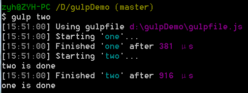

## gulp.task(name[,deps][,fn])
使用[Orchestrator](https://github.com/robrich/orchestrator)（一个定序的可执行的任务模型，依赖于最大并发量。）模型定义一个任务。  

1. name：字符串类型，该任务的任务名，你可以通过命令行执行一个任务，故任务名中不应该出现空格。
2. deps：数组类型，定义一个依赖任务数组，当前定义的任务会在数组中所有依赖的任务执行完毕后才开始执行。如当前定义的任务如果没有依赖，则可忽略这个参数。  
注意，如果我们执行集中执行一堆依赖任务而不做别的，可以忽略gulp.task()的第三个参数。  

		gulp.task('build',['array','of','task']);
3. fn：函数类型，定义一个执行该任务主要操作的函数。

通常用法：  

	gulp.task('buildStuff', function(){
		var stream = gulp.src(/*some source path*/)
		.pipe(somePlugin())
		.pipe(someOtherPlugin())
		.pipe(gulp.dest(/*some destination*/));
		return stream;
	});

[官网介绍](https://github.com/gulpjs/gulp/blob/master/docs/API.md#gulptaskname--deps--fn)  
### 异步任务
如果任务相互之间没有依赖，任务会按你书写的顺序来执行，如果有依赖的话会先执行依赖的任务。  
如果某个任务所依赖的任务是异步的，那就要注意了，gulp并不会等待所依赖的异步任务完成，而是会接着执行后续的任务。例如：  

	gulp.task('one',function(){
	setTimeout(function(){
		console.log('one is done');
	},5000);
	});
	gulp.task('two', ['one'], function(){
		console.log('two is done');
	});
运行结果如下：  

如果你想等待异步任务中的异步操作完成后再执行后续的任务，官网也介绍了三种方法，但我还没用过。